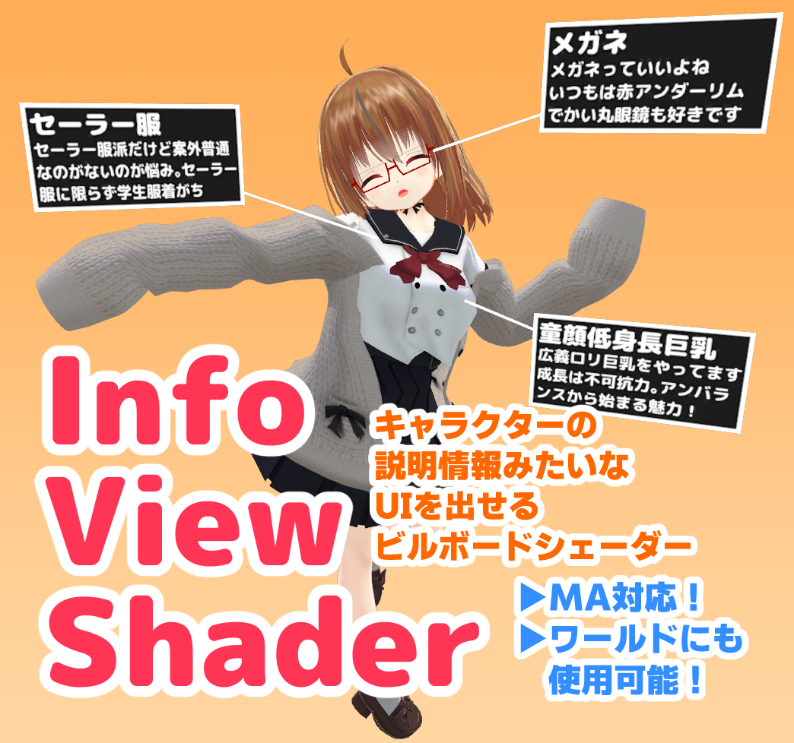

# Info View Shader

キャラ情報表示みたいなUIを作れるシェーダー

## インストール

### OpenUPM

See [OpenUPM page](https://openupm.com/packages/net.narazaka.unity.info-view-shader/)

### VCC用インストーラーunitypackageによる方法（おすすめ）

https://github.com/Narazaka/InfoViewShader/releases/latest から `net.narazaka.unity.info-view-shader-installer.zip` をダウンロードして解凍し、対象のプロジェクトにインポートする。

### VCCによる方法

1. https://vpm.narazaka.net/ から「Add to VCC」ボタンを押してリポジトリをVCCにインストールします。
2. VCCでSettings→Packages→Installed Repositoriesの一覧中で「Narazaka VPM Listing」にチェックが付いていることを確認します。
3. アバタープロジェクトの「Manage Project」から「Info View Shader」をインストールします。

## 使い方

### NDMF(Modular Avatar)の入ったVRChat アバタープロジェクトの場合

事前にNDMFまたはModular Avatarをインストールして下さい。

1. アバターかアバター内のオブジェクトを右クリックして `InfoViewShader→Create InfoView`で1つの情報表示が作れます。
     - Add Componentから`InfoView`コンポーネントを追加する方法も可能です。
2. InfoViewコンポーネントを設定して下さい。

- Modular Avatarをインストールすると、ローカル環境で非表示にする機能が使えるようになります。

### 一般的な場合

Exampleフォルダに例があります。

1. Cubeを描画される可能性のある領域を覆う大きさにして配置する。
2. InfoViewShader/BillboardWithOffsetで情報ウインドウを、InfoViewShader/BillboardConnectLineで指示線のマテリアルを作り、Cubeに適用する。

## ユースケース

ユースケース

1つから配置可能です。好きな画像を作ってキャラクター説明して下さい。画像が512x256くらいのサイズ、スケール X=0.3, Y=0.15くらいがおすすめです。

透過も使えます。台詞とかをいれても面白いかも。

エロRPG的な表示にもうってつけです。

## 更新履歴

- 1.4.0
  - 「ローカルで非表示」にした場合にミラーやカメラには映るように
- 1.3.2
  - ChilloutVRのMirrorでもVRCと同様反転表示されるように
- 1.3.1
  - Single-pass instanced (SPS-I) 対応
- 1.3.0
  - 距離で非表示にする機能
  - 最低限のGPU Instancing対応
- 1.2.2
  - NDMF 1.5が必要な旨を警告
- 1.2.1
  - Unity 2019に緩和
- 1.2.0
  - VRChatアバターにおいてローカルで非表示にする機能を追加
  - NDMF言語選択UIを追加
- 1.1.0
  - NDMF対応
  - lineシェーダーもCutout/Transparent対応
- 1.0.0
  - リリース

## License

[Zlib License](LICENSE.txt)
